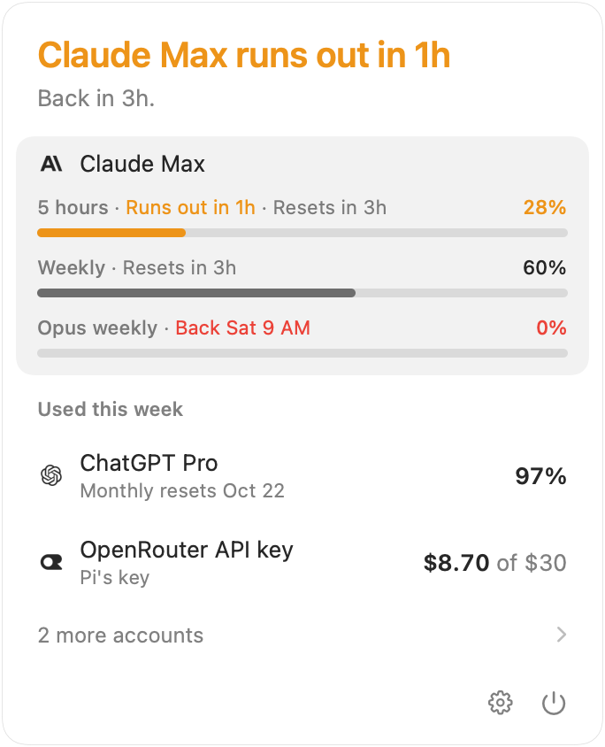

# Turnscope

[](https://github.com/joeychilson/turnscope/releases/latest)
[](https://github.com/joeychilson/turnscope/actions/workflows/ci.yml)
[](LICENSE)

See whether your coding agents' limits will last, from the menu bar.

Turnscope reads the history Claude Code, Codex, OpenCode, Pi and Grok Build keep on your Mac, and the limits of every account they use. It also runs an MCP server, so your agents can check those limits themselves.

<picture>
  <source media="(prefers-color-scheme: dark)" srcset=".github/screenshots/panel-dark.png">
  
</picture>

## Install

Download the latest [release](https://github.com/joeychilson/turnscope/releases/latest) and drag Turnscope to Applications. Requires macOS 26. Updates install through Sparkle.

## Features

- **Menu bar**: what's left of each account in use, or how long until it runs out.
- **Panel**: whether you can keep going, each account's limits, and what used them.
- **Notifications**: when a limit will run out, is used up, or is back.
- **Multiple accounts**: every subscription and API key counts on its own, including second accounts in their own config folders.
- **MCP server**: connect Claude Code, Codex, OpenCode, Pi or Grok Build from Settings › Agents.

Gray means you're fine. Amber means a limit will run out before it resets. Red means it has.

## For your agents

| Tool            | Answers                                         |
| --------------- | ----------------------------------------------- |
| `check_limits`  | How much is left, and will it last?             |
| `explain_limit` | What used a limit, and why?                     |
| `find_sessions` | Which sessions match?                           |
| `get_session`   | What was a session doing, and what did it use?  |
| `read_session`  | What exactly was said and done?                 |
| `get_usage`     | How many tokens, and what did they cost?        |

Three prompts come with it: `catch-up` continues the latest session in a folder, `pace` fits a task to what's left, and `what-used` explains your week.

A hook can turn a limit into a rule. This Claude Code hook stops subagents while less than half the week is left:

```json
{ "hooks": { "PreToolUse": [{
  "matcher": "Task|Agent",
  "hooks": [{ "type": "command", "command": "/Applications/Turnscope.app/Contents/Helpers/turnscope guard --limit week --below 50" }]
}]}}
```

## Command line

The `turnscope` command is in the app, at
`/Applications/Turnscope.app/Contents/Helpers/turnscope`. Nothing puts it on
your `PATH`: run it by that path, or alias it.

```sh
turnscope mcp                          # the MCP server, over stdio
turnscope connect [agent]              # add the MCP server to an agent
turnscope call <tool> ['<json>']       # run one MCP tool
turnscope guard --limit week --below 50
turnscope doctor                       # check what was read
```

## Privacy

Turnscope only reads your agents' files and never changes them. Everything stays on your Mac. It contacts only your providers' usage endpoints, [models.dev](https://models.dev) for prices, and GitHub for updates. No telemetry.

## Building

The engine, MCP server and CLI are Rust in `crates/`; the app is Swift in `macos/`. [CONTRIBUTING.md](CONTRIBUTING.md) says how to build and run it, and [AGENTS.md](AGENTS.md) holds the conventions.

## License

[MIT](LICENSE). Prices and logos from [models.dev](https://models.dev). Agent and provider names belong to their owners.
