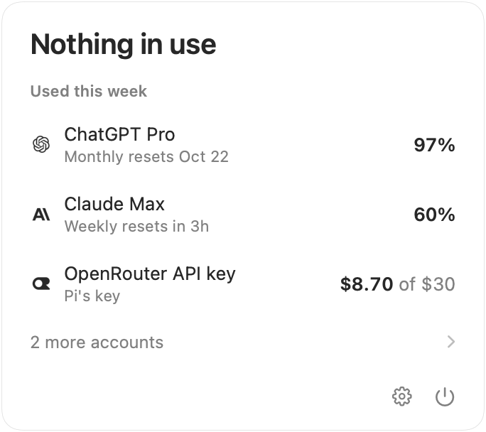
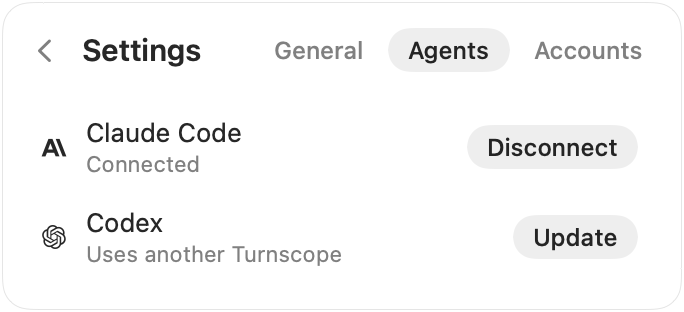

# Turnscope

[](https://github.com/joeychilson/turnscope/releases/latest)
[](https://github.com/joeychilson/turnscope/actions/workflows/ci.yml)
[](LICENSE)

See how much of your coding agents' usage limits is left, whether it will
last until the reset, and what used it.

<p>
  <picture>
    <source media="(prefers-color-scheme: dark)" srcset=".github/screenshots/panel-dark.png">
    
  </picture>
  <picture>
    <source media="(prefers-color-scheme: dark)" srcset=".github/screenshots/idle-dark.png">
    
  </picture>
</p>

Turnscope is a macOS menu bar app, a command line tool and an MCP server.
It reads the history and logins your coding agents keep on your Mac, asks
each provider for your limits, and forecasts when each one runs out.

## Features

- **Limits at a glance.** What's left of every limit, when it resets, and
  when it runs out at your pace.
- **Work left.** How many hours of agent work each limit has left, with an
  80% range. The pace counts only the hours your agents were working, not
  clock time. Shown in the command line and to your agents.
- **What used it.** Usage and cost by session, project, model, agent or
  account. Each response is priced at the list price when it ran.
- **Handoffs.** Everything another agent needs to finish a session's work:
  every request you made, the agent's latest summary, what it found and did,
  and where it stopped.
- **MCP server.** Agents can check their limits before costly work, see
  what used them, and pick up where other sessions stopped.
- **Notifications.** When a limit is about to run out, is used up or is
  back, and when an account needs signing in again.

| | Supported |
|---|---|
| Agents | Claude Code, Codex, OpenCode, Pi, Grok Build |
| Providers | Anthropic (Claude), OpenAI (ChatGPT), xAI (SuperGrok), OpenCode Go, OpenRouter |

## Install

Requires macOS 26, on Apple silicon or Intel.

1. Download `Turnscope-<version>.dmg` from the
   [latest release](https://github.com/joeychilson/turnscope/releases/latest).
2. Open it and drag Turnscope to Applications.
3. Open Turnscope. It lives in the menu bar and checks for updates.

To use the command line, link it onto your `PATH`:

```sh
sudo mkdir -p /usr/local/bin
sudo ln -sf /Applications/Turnscope.app/Contents/Helpers/turnscope /usr/local/bin/turnscope
```

## Quick start

```sh
turnscope status                  # every account's limits, forecasts and work left
turnscope status --hours 3        # whether 3 more hours of work fit
turnscope usage --by model        # the last 30 days by model, at list prices
turnscope usage --limit week      # what used your weekly limit
turnscope sessions --since today  # today's sessions
turnscope handoff                 # a handoff of the latest session in this folder
turnscope doctor                  # what can't be read, and how to fix it
```

Add `--json` to any command that prints data. See [docs/cli.md](docs/cli.md).

## Connect your agents

In the app, open Settings → Agents and choose Connect, or Disconnect to
remove it. Or from the command line:

```sh
turnscope connect               # which agents have Turnscope's MCP server
turnscope connect claude-code   # add it, using the agent's own command
turnscope disconnect codex      # remove it
```

<picture>
  <source media="(prefers-color-scheme: dark)" srcset=".github/screenshots/agents-dark.png">
  
</picture>

A connected agent can ask how much work its limit has left, what used it,
and where another session stopped. It needs no ids: the server knows which
agent, folder and account is asking. The tools are `check_limits`,
`explain_usage`, `find_sessions`, `handoff` and `read_session`
([docs/mcp.md](docs/mcp.md)).

Two commands fit Claude Code's `settings.json`. [`guard`](docs/cli.md#guard)
stops subagents from starting when your weekly limit has under 10% left, and
[`statusline`](docs/cli.md#status-line) shows your limits under the prompt:

```json
{
  "hooks": {"PreToolUse": [{"matcher": "Agent",
    "hooks": [{"type": "command", "command": "turnscope guard --limit week --below 10"}]}]},
  "statusLine": {"type": "command", "command": "turnscope statusline"}
}
```

## Privacy

- Turnscope reads your agents' history, and their logins from their files
  and the Keychain. It never changes them. The one change it makes, when
  you ask, is adding or removing its MCP server, with the agent's own
  command.
- Each login is sent only to the provider it belongs to, to read your
  limits. No secret is stored: an API key is kept only as a fingerprint.
- It also downloads model prices from [models.dev](https://models.dev) and
  updates from GitHub. There is no telemetry.

## Uninstall

1. Disconnect each agent you connected, in Settings → Agents or with
   `turnscope disconnect <agent>`. OpenCode has no command for it, so
   [remove it by hand](docs/mcp.md#connect-an-agent).
2. Quit Turnscope and move it from Applications to the Trash.
3. Remove the command line link, Turnscope's data and its settings:

```sh
sudo rm /usr/local/bin/turnscope
rm -rf ~/Library/Application\ Support/com.joeychilson.turnscope
defaults delete com.joeychilson.turnscope
```

## How it works

One Rust binary reads the agents' files into a local SQLite database as they
change, reads each account's limits with the logins the agents already hold,
and forecasts each limit. The menu bar app talks to it over a local socket,
and the command line and MCP server are the same binary. See
[docs/architecture.md](docs/architecture.md).

## Documentation

- [Command line](docs/cli.md): every command and flag
- [MCP server](docs/mcp.md): connecting agents, and the tools they get
- [Handoffs](docs/handoff.md): what a handoff holds, and why
- [The app](docs/app.md): the menu bar app and its settings
- [Architecture](docs/architecture.md): how Turnscope works
- [The app's protocol](docs/protocol.md): how the app talks to `turnscope serve`
- [Adding an agent](docs/adding-an-agent.md) and [a provider](docs/adding-a-provider.md)
- [Development](docs/development.md): building, testing and releasing

## License

[MIT](LICENSE)
